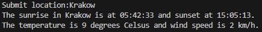

# Sunrise and Sunset Checker App



The Sunrise and Sunset Checker App is a Python application that allows you to check the sunrise and sunset times based on a given location. It uses data from the SunAPI to provide accurate information about the solar events. Additionally, the app fetches weather data to provide current temperature and wind speed for the specified location.

## Table of Contents

- [Introduction](#introduction)
- [Features](#features)
- [Usage](#usage)
- [Prerequisites](#prerequisites)
- [Installation](#installation)
- [APIs Used](#apis-used)
- [Contributing](#contributing)
- [License](#license)

## Introduction

The Sunrise and Sunset Checker App is a helpful tool for users who want to know when the sun rises and sets at a specific location. It also provides current weather information for that location, including temperature and wind speed.

## Features

- Retrieve accurate sunrise and sunset times based on a given location.
- Fetch current weather data, including temperature and wind speed.
- User-friendly command-line interface.
- Utilizes the SunAPI for solar event data.

## Usage

1. Run the app by executing the Python script.
   ```bash
   python sunrise_sunset_checker.py
2. Enter the location for which you want to check sunrise, sunset, and weather data.

3. The app will provide you with the sunrise and sunset times, as well as the current temperature and wind speed.

## Prerequisites
Before using the app, make sure you have the following prerequisites:

Python 3.x installed on your system.
Installation
Clone the repository to your local machine.

  ```bash
  git clone https://github.com/yourusername/sunrise-sunset-checker.git
  Install the required Python packages.
  ```

  ```bash
pip install requests
```
## APIs Used
Nominatim API: Used to obtain location coordinates.
SunAPI: Provides sunrise and sunset data.
Open Meteo API: Fetches current weather information.
## Contributing
We welcome contributions! If you'd like to contribute to the Sunrise and Sunset Checker App, please check our Contribution Guidelines.

## License
This app is licensed under the MIT License. See the LICENSE file for more details.
